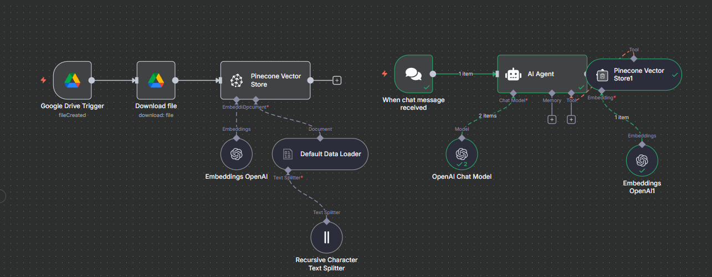

# 🤖 Automated FAQ Assistant (n8n + OpenAI)

This project is an **AI-powered FAQ assistant** built with **n8n**.  
It reads a company FAQ file, generates embeddings, and automatically assists clients with accurate answers via chat platforms like **Telegram/Slack/Website**.  

---

## 🚀 Features
- Reads FAQ documents and builds embeddings.
- Uses **OpenAI** to answer client questions based only on FAQ content.
- Provides polite fallback response when an answer is not found.
- Can be connected to **Telegram, Slack, or Webchat**.

---

## 🛠️ Tech Stack
- [n8n](https://n8n.io) – Workflow Automation
- OpenAI Embeddings – AI-powered search
- Vector Store (e.g., Pinecone, Qdrant, Supabase) – For storing embeddings
- Telegram/Slack Integration – For client-facing chat

---

## 📸 Workflow Preview

---

## 🔄 Workflow Export
The complete n8n workflow is available here:  
👉 [WORKFLOW/1. Rag pipeline And chatbot.json]

You can **import this JSON into n8n** to try it yourself.

---

---

## 📌 Example Use Case
[Example.png]
**Client:** *“How do I reset my password?”*  
**Bot:** *“You can reset your password by going to the account settings page and clicking ‘Forgot Password’. A reset link will be sent to your email.”*  

How to Use This n8n Workflow

Follow these steps to import and use the workflow JSON file in n8n:

Step 1: Open n8n

Log in to your n8n account (either self-hosted or cloud).

Step 2: Go to Workflows

On the left sidebar, click Workflows.

Step 3: Import Workflow

At the top-right corner, click the three dots (⋮) menu.

Select Import from File.

Step 4: Upload JSON File

Choose the JSON file you downloaded from this repository.

Click Open.

Step 5: Save the Workflow

Once the workflow is loaded, click Save.

Step 6: Run the Workflow

You can now click ▶ Execute Workflow to test it.

✅ That’s it! You have successfully imported and can now use the workflow.
---

## 👨‍💻 Author
**Harsh Rokade**  
- [LinkedIn](https://www.linkedin.com/in/harsh-rokade/)  
- [GitHub](https://github.com/Harshrokade)  
